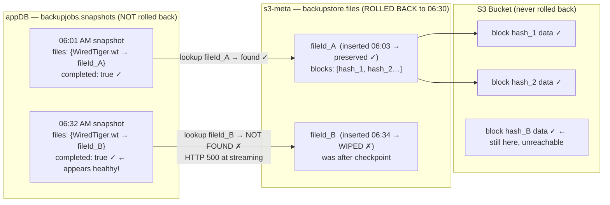
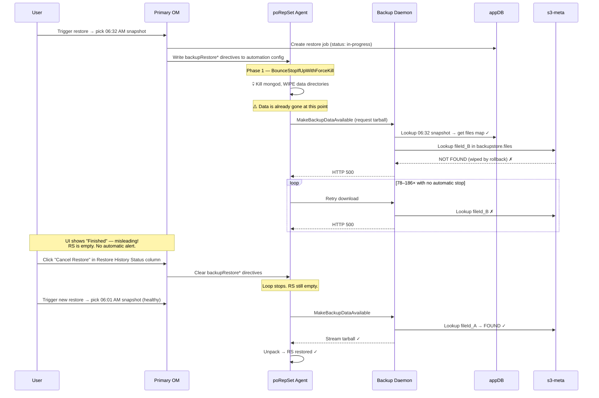

# Backup-Stores Rollback Impact PoC — Findings

## Setup recap

Meta OM manages and backs up three databases that Primary OM uses for its own backup machinery:

| Backing DB | Purpose |
|---|---|
| **`appdb-rs`** | Primary OM's own appDB — holds project config, deployment topology, snapshot index, oplog cursor positions |
| **`s3-meta-rs`** | S3 blockstore metadata — index of every WiredTiger block stored in S3, mapped to snapshot ids |
| **`oplog-meta-rs`** | Oplog store metadata — index of oplog slices that back PITR/continuous restore |

Primary OM independently backs up the customer deployment **`poRepSet`**, with its data blocks and oplog slices flowing through the three stores above.

The PoC: roll back one or more of the three stores in time, then observe what happens to `poRepSet`'s snapshots in the Primary OM UI/API. Each scenario records hypothesis → action → observation → conclusion so we can build a mental model of which store gates which capability.

---

## Methodology

For each scenario:
1. **Baseline.** Run [list-snapshots.sh](list-snapshots.sh) and paste the markdown table.
2. **Hypothesis.** Predict which `poRepSet` snapshots survive, become unrestorable, or disappear from the API.
3. **Action.** Trigger the restore in the Meta OM UI (Continuous Backup → ⋮ → *Restore*) and pick the target snapshot.
4. **Wait.** Allow the agent in the chosen store's container to apply the restore (mongod gets stopped, files swapped, mongod restarted).
5. **Re-list.** Capture the post-restore inventory.
6. **Probe.** Try a `poRepSet` restore (any snapshot) via Primary OM UI — does it succeed, fail, or vanish? Also check Primary OM logs for backup errors.
7. **Conclude.** What does this tell us about that store's role?

---

> Operational and architectural side-findings (container PID-1 entrypoint fix, DR checklist for a Meta-OM-backs-Primary-OM topology) are documented in [SIDE-FINDINGS.md](SIDE-FINDINGS.md).

---

## Key Findings

### Scenario 1 — Roll back `s3-meta-rs` only

**Role of `s3-meta-rs`:** The block-to-S3-object index. Every WiredTiger block uploaded during a `poRepSet` snapshot is registered here. Primary OM reads this index at restore time to stream blocks from S3 to the agent.

**Observed behaviors:**

- **Post-rollback `poRepSet` snapshots become unrestorable.** Any snapshot whose block registrations fall after the rollback target is broken: the daemon cannot translate the snapshot manifest into S3 reads.
- **Broken snapshots are NOT proactively flagged.** They remain listed as `complete=true` in the API and appear normally in the UI snapshot picker. A user sees no warning until the restore is attempted.
- **The failure surfaces late — at agent download time.** The restore job's `progress.currentPhase` transitions to `completed` (the URL is staged), but when the agent fetches the tarball the daemon returns HTTP 500 (`MakeBackupDataAvailable` fails). Any automation that gates on `statusName=FINISHED` would silently launch a doomed restore.
- **The only UI signal of a broken restore is the download retry count.** A clean restore completes in ~2 min with **3 downloads**. A broken restore loops indefinitely — we observed **78–186 downloads** with no automatic stop. The Status column still shows **"Finished"** (if cleared via API) or **"Cancelled"** (if cancelled via UI), never a distinct "Failed" state.
- **The system does NOT self-heal.** `TwoPhaseDeploymentJob` Phase 2 (which clears `backupRestore*` directives) never fires because Phase 1 requires all members to successfully download the snapshot — which permanently fails with HTTP 500 when blocks are missing. The retry loop runs indefinitely until manually stopped.
- **Customer recovery via UI: "Cancel Restore" in the Restore History status column.** Clicking the stuck restore's Status column entry in Restore History reveals a "Cancel Automated Restore" dialog. Confirming stops the retry loop and sets the job to **"Cancelled"**. This is the lowest-friction UI recovery path. Note: MODIFY → Review & Deploy does **not** work — the UI deployment path does not touch internal `backupRestore*` fields.
- **Cancelling does not restore original data — the replica set is left empty.** The warning in the Cancel dialog is accurate: once a restore starts, the agent wipes the data directories before downloading. By the time the retry loop is visible, the original RS data is already gone. After cancelling, the customer must perform a fresh restore from a healthy pre-rollback snapshot to recover any data. If no healthy snapshot exists (all post-rollback snapshots are broken), data recovery is impossible via the normal restore path.
- **Recovery path works end-to-end: Cancel → restore from a pre-rollback snapshot.** After cancelling Probe 4, restoring from the 06:01 AM snapshot (last clean pre-rollback) successfully recovered data in `poRepSet`. The pre-rollback snapshots remain fully restorable even after multiple broken restore attempts on post-rollback snapshots. The data in S3 and the block index in `s3-meta-rs` for pre-rollback snapshots are intact throughout.
- **New `poRepSet` snapshots after rollback are immediately healthy.** Block metadata re-registers in s3-meta-rs with the fresh post-rollback state; the next snapshot is restorable end-to-end.
- **`poRepSet` snapshot index is unaffected.** Because the index lives in `appdb-rs` (not touched), all snapshots remain listed in the API — both the broken and the healthy ones. No entries vanish.
- **Daemon does not groom orphaned snapshot entries.** Snapshots whose block metadata is wiped remain listed as `complete=true` indefinitely; Primary OM has no built-in mechanism to detect or mark them as non-restorable.
- **PITR range is unaffected, but PITR restores to post-rollback times fail.** The oplog-slice index (`oplog-meta-rs`) is untouched, so the PIT picker range stays continuous. However, a PITR to any time that forces the picker to auto-select a broken starter snapshot (i.e., a target time after the rollback point where the most recent snapshot has wiped blocks) fails with the same HTTP 500 at block streaming. Confirmed: PITR to 8:00 AM auto-selected the 07:33 AM snapshot (`backupRestoreCheckpointTimestamp: 07:33:48Z`) as the starter — that snapshot's blocks are wiped → HTTP 500 loop. A PITR to a time *before* the rollback point (which forces the picker to select a pre-rollback clean snapshot) would succeed.
- **No race condition with Primary OM running during restore.** The ~2 min 20s window where s3-meta-rs mongod is stopped produced zero errors in Primary OM — the MongoDB driver reconnected automatically. No snapshot was in-flight during that window.
- **`api.created` ≠ block-registration time.** The API "created" timestamp is when the snapshot *process started*, not when blocks were fully registered. The ObjectId insertion timestamp of a s3-meta snapshot reveals when the WiredTiger checkpoint was captured: any `poRepSet` snapshot whose blocks were written to `backupstore.files` after that ObjectId timestamp is broken post-rollback. See [Appendix — ObjectId timing](#appendix--objectid-timing-note) for details.

---

### Scenario 2 — Roll back `oplog-meta-rs` only

**Role of `oplog-meta-rs`:** The oplog-slice index for PITR replay. Each doc maps a compressed oplog slice to its S3 key. Primary OM scans this collection (filtered by rsId, ordered by `end`) to find the slices needed to replay the oplog between any two timestamps.

**Observed behaviors:**

- **PITR End shrinks to the rollback target immediately.** Primary OM uses `<groupId>.slices` as the authoritative oplog inventory, so wiping post-target slice docs cuts the restorable End cleanly.
- **Snapshot-only restores are completely unaffected.** Rolling back oplog-meta-rs has zero impact on snapshot listing or snapshot restore; those paths do not read this store.
- **A permanent gap appears in the PITR view.** The period from the rollback target to the rollback completion is permanently lost from the PIT picker (oplog slice index wiped, S3 data still physically there but unreachable). Unlike Scenario 3's appdb-only rollback, this gap is visible and permanent.
- **Gap detection is clean and early.** Primary OM rejects PITR queries inside the gap at picker validation time with `"Invalid restore point. Detected gap within requested oplogs"` — before any restore job is created. Much friendlier than the Scenario 1 late HTTP-500.
- **Multiple restorable ranges appear after recovery.** Once a new `poRepSet` snapshot is taken after rollback, the PIT picker shows a fresh range (rollback-completion → now) alongside the surviving old ranges. In Run 2, three separate ranges were visible: the preserved pre-rollback range (A), the WiredTiger checkpoint survivor range (B, 10:20–10:24), and the new post-recovery range anchored by the first fresh snapshot. The system resumes PITR coverage automatically; no manual nudge needed.
- **PITR Start creeps forward continuously post-rollback.** Background grooming of oplog-meta-rs removes the oldest slices over time. Immediately after rollback, the old range's Start moved +8 min; by the time PITR was re-checked (hours later), it had crept to +36 min. This is cosmetic data loss (fringe minutes at the edges), but it confirms the groom job runs against the live rolled-back state and the Start boundary drifts monotonically forward until the next snapshot anchors it.
- **Effective rollback boundary is later than the snapshot's `api.created` time.** The WiredTiger checkpoint used by the snapshot buffers recent writes beyond the trigger time (auto-checkpoint interval ~60s). In Run 2, the 10:02 AM snapshot preserved slices through ~10:24 AM — 22 min beyond the API time. Slices from 10:24 AM onwards were wiped, but slices between 10:02 and 10:24 survived unexpectedly. The practical implication: when picking a rollback target to "cut off" a specific time, the actual cut may happen up to `checkpoint_interval` later than expected.
- **Cross-scenario interaction:** The PITR picker auto-selects a starter snapshot based on time alone, without checking block health. If the auto-picked starter falls inside an s3-meta broken window (from a prior S1-type rollback), PITR fails at block streaming even though oplog-meta is fully intact and the oplog slices for the target time exist. The picker does not expose snapshot health, and the failure mode is the same HTTP-500 retry loop as S1 (66–75 pulls before cancellation). **Fix:** deleting the broken snapshot's `backupjobs.snapshots` doc (via UI delete or direct DB surgery) causes the picker to fall back to the next-older clean snapshot. After deletion, PITR to the same target time succeeds immediately (`pull_count=3`, ~1 min).

---

### Scenario 3 — Roll back `appdb-rs` only

**Role of `appdb-rs`:** The operational brain of Primary OM's backup system. Holds `backupjobs.snapshots` (the snapshot index), `backupjobs.jobs` (the oplog cursor position and backup schedule), `automationcore.config.automation` (agent desired-state), and all project/cluster metadata.

**Observed behaviors:**

- **Post-rollback snapshots vanish from the API immediately (HTTP 404).** Unlike Scenario 1 (where broken snapshots appear to exist but fail at download), an appdb-rs rollback removes the index entry entirely. Users cannot even submit a restore job for forgotten snapshots — cleaner failure UX.
- **Pre-rollback snapshot data is physically intact.** S3 blocks (in `s3-meta-rs`) and oplog slices (in `oplog-meta-rs`) are untouched. Forgotten snapshots could theoretically be recovered by recreating the appdb-rs index entry, but no OM API exposes this.
- **Groomed snapshot entries are resurrected.** The rolled-back appdb may have retained many more snapshot index entries than the live appdb had (because retention groom runs over time). These resurrected entries appear `complete=true` but their S3 block data may already have been deleted — silently broken, same failure mode as Scenario 1.
- **Primary OM recovers immediately and automatically.** Within ~6 minutes of restore completion, a fresh `poRepSet` snapshot is registered. No daemon restart, no agent nudge, no manual intervention.
- **No visible PITR gap — key contrast with Scenario 2.** Because `oplog-meta-rs` is intact and holds continuous oplog slices through the rollback period, the backup daemon re-tails from the (regressed) cursor position in the restored appdb and catches up to current time within minutes. The PIT picker shows a single seamless range. Rolling back the oplog index (S2) creates a permanent gap; rolling back only the cursor pointer (S3) does not.
- **`api.created` ≠ insertion time, registration-time gap can swallow a snapshot.** The API "created" field is the snapshot-process *start* time; the appdb doc is inserted at *completion*. Rollback boundaries measured in API times can silently miss snapshots that completed right at the boundary. The only reliable guard is choosing a rollback target well after the last snapshot's ObjectId insertion timestamp.
- **Automation config may regress.** `automationcore.config.automation` rolls back too. If the goal-config version at the rollback target differs from now, the automation agent may briefly replay older config against live `poRepSet` members. Observed to be transient in practice (agent converges quickly).
- **Group-level config regression causes transient monitoring metric drops (observed with Primary OM running).** The rolled-back appdb may have empty or stale group-level retention policies. Primary OM detects the mismatch between the rolled-back appdb state and the live registry cache, logs `WARN Retention policies for group and global registry are incompatible. Group retentions:[]`, and skips monitoring samples until it reconciles. This effect is only visible when Primary OM remains running during the restore — in Run 1 (Primary OM not running), it was not observed. Any customer running OM live during an appdb-rs rollback should expect a brief monitoring data gap.
- **PITR range display is misleading after anchor snapshots are forgotten — and targets within the displayed range are rejected at validation.** The PIT picker continues to show a wide restorable range (e.g., 05/10 04:27 AM → 05/11 04:26 AM) even after the rollback has wiped the appdb entries for the anchor snapshots that normally bound that range. But when a target within that range is submitted, OM's oplog storage window check (49 h, measured from **now** not from the target time) rejects it with `"Invalid restore point: The last snapshot before the recovery PIT is older than the Oplog storage window of 49 hours"` — because the only surviving starter (`69fdaf20`, May 8 09:36 AM) is ~66 h old. No restore job is created and no data wipe occurs (early rejection — better failure mode than Scenario 1). The range is doubly misleading: (1) targets within it appear valid but will be rejected unless a starter snapshot within the 49-hour window exists; (2) the >43-hour replay depth is not surfaced anywhere. Blocks on the May 8 starter are confirmed healthy (52/52 fileIds in s3-meta), so the only barrier is the policy gate, not block availability.

---

## Future scenarios (running list)

| # | Description | Why interesting |
|---|---|---|
| 4 | Roll back **`s3-meta-rs` + `oplog-meta-rs`** to matching timestamps | Coordinated rollback, no PITR available beyond the rollback point |
| 5 | Roll back **all three** to a shared timestamp | Equivalent to a full Primary OM disaster recovery — should be coherent |
| 6 | Roll back stores to **mismatched** timestamps (e.g. appdb @ T0, s3-meta @ T1, oplog @ T2) | Reveals which store's view of "the world" is authoritative when they disagree |
| 7 | After scenario 1 (s3-meta rollback), trigger a `poRepSet` restore *to a new RS* and see if data lands | Differentiates "metadata broken" from "data gone" |

---

## Reference commands

```bash
# Re-baseline at any time
./om-backup-stores/list-snapshots.sh --md

# Verify all infra healthy + schedules at 15 min
./om-backup-stores/3-verify-setup.sh

# Schedule cap at 15 min after re-enabling backup
./om-backup-stores/2-set-snapshot-interval.sh

# Restart agents in the 3 backing-DB containers (after Meta OM restores mongod)
./om-backup-stores/1-restart-agents.sh
```

---

---

# Appendix

## Appendix — Data layer: what appDB and s3-meta actually store

### `backupjobs.snapshots` (Primary OM appDB, port 27018)

This collection is the **snapshot index** — the source of truth for what the OM API returns when listing snapshots. One document per RS snapshot.

```
{
  _id:              ObjectId  // insertion time = completion time (NOT start time)
  rsId:             "poRepSet"
  groupId:          ObjectId
  jobId:            ObjectId  // links to backupjobs.jobs (the backup schedule entry)
  backupId:         UUID      // stable identifier for this RS's backup configuration
  snapshotStoreId:  "s3store"
  snapshotStoreType:"s3blockstore"

  timestamp:        Timestamp // WiredTiger checkpoint timestamp (oplog position at snapshot)
  startTime:        Date      // when the backup agent started capturing this snapshot
  endTime:          Date      // when the snapshot was fully uploaded and registered
  completed:        true
  deleteAt:         Timestamp // expiry — set by retention policy

  blockSize:        16777216  // 16 MB WiredTiger block size
  compressionSetting: "GZIP"
  storageEngine:    "wiredTiger"
  mongodVersion:    "8.0.19"
  featureCompatibilityVersion: "8.0"
  lastOplog:        Timestamp // last oplog entry included; PITR can replay from here

  files: {
    "WiredTiger":                    { fileId: ObjectId('69f9cc…cb'), snapshotted: true },
    "WiredTiger backup":             { fileId: ObjectId('69f9cc…ca'), snapshotted: true },
    "collection-0-12701… wt":        { fileId: ObjectId('69f9cc…a6'), snapshotted: true },
    "index-1-12701… wt":             { fileId: ObjectId('69f9cc…a7'), snapshotted: true },
    // ... ~42 entries total for a typical RS data directory
  }
}
```

**The `files` map is the join key into s3-meta.** Each `fileId` value is the `_id` of a document in `backupstore.files` on s3-meta-rs. Rollback of appDB wipes this index doc; the snapshot disappears from the API. Rollback of s3-meta leaves this doc intact (snapshot appears `complete=true`) but makes the `fileId` references dangle — lookup returns nothing → HTTP 500 at download.

---

### `backupstore.files` (s3-meta-rs, port 27019)

One document per file per snapshot — the **block-to-S3 index**. Its `_id` is the `fileId` stored in `backupjobs.snapshots.files`. ~42 docs per snapshot × N snapshots = 10,000+ docs in a mature deployment.

```
{
  _id:             ObjectId  // = the fileId referenced from backupjobs.snapshots.files
  filename:        "journal/WiredTigerLog.0000000001"  // WT file name inside the data dir
  size:            104857600  // uncompressed size in bytes
  blockSize:       16777216   // 16 MB
  blockstoreDBRoot: ObjectId  // = jobId from backupjobs — groups all files for one backup job
  phase:           "A"        // incremental phase (A/B alternating)

  blocks: [
    { hash: "CFD5A9BD824E0ECC…", size: 96703 },  // SHA-256 of block content
    { hash: "3A7F12BC…",         size: 16777216 },
    // ... one entry per 16 MB block in this file
  ]

  backingFileObj:  <ref>      // internal reference to the backing S3 object
}
```

**How restore streaming works:**

1. Daemon looks up the snapshot doc in `backupjobs.snapshots` → gets the `files` map
2. For each file, looks up `backupstore.files` by `fileId` → gets the `blocks` array
3. For each block hash, constructs the S3 key (hash-derived path) → fetches block from S3
4. Streams reassembled blocks back to the agent as a tarball

After an s3-meta rollback, step 2 returns nothing (doc wiped) → daemon returns HTTP 500 → `"Cannot find a blockfile after retries"`. The S3 objects themselves are still physically present in the bucket — only the index is gone.

---

### Potential fixes for broken snapshots after an s3-meta rollback

The S3 data blocks are **still in S3** — only the index layer is wiped. Three recovery options exist, roughly in order of feasibility:

**Option 1 — Delete the broken snapshot entries from appDB (simplest, data loss accepted)**

Drop the `backupjobs.snapshots` docs for all post-rollback snapshots. They disappear from the API and UI, no longer confusing customers or blocking restores. The orphaned S3 blocks will be cleaned up by the next groom job. Pre-rollback snapshots remain fully restorable.

```js
// In Primary OM appDB (port 27018), backupjobs db:
// Identify broken snapshot _ids (those inserted after the s3-meta rollback checkpoint time)
// then delete them — they vanish from the API and UI immediately.
db.snapshots.deleteMany({ rsId: "poRepSet", _id: { $gt: ObjectId("<id-of-last-clean-snap>") } })
```

**Option 2 — Restore s3-meta from a newer backup (if one exists)**

If a Meta OM backup of s3-meta-rs exists that post-dates the broken snapshots' registration time, restoring s3-meta from that backup re-populates the `backupstore.files` docs and makes the broken snapshots restorable again. This is the cleanest fix but requires a suitable backup target.

**Option 3 — Re-scan S3 and rebuild the index (not supported out-of-box)**

The S3 bucket contains all blocks keyed by hash. In principle, scanning the bucket and re-inserting `backupstore.files` docs would recover the index. However, OM exposes no API for this and the mapping from S3 object key → `{filename, blockstoreDBRoot, phase}` requires knowledge that isn't stored in S3 metadata alone. This would require MongoDB support tooling or custom scripting.

**Practical recommendation:** Use Option 1 to clean up the broken entries, then verify pre-rollback snapshots are restorable, and let the system take fresh snapshots going forward.

---

## Appendix — Scenario 1 diagrams

### How a snapshot becomes broken after s3-meta-rs rollback



### Restore flow — where it fails and why the RS ends up empty



**Key insight:** the data wipe (step 3) executes before the first download attempt (step 4). The fix belongs at the point marked "Write backupRestore\* directives" — validate fileId existence in s3-meta _before_ the agent receives the wipe instruction.

---

## Appendix — ObjectId timing note

The "created" timestamp shown in the OM API for a snapshot is the **snapshot-process start** time, not when the snapshot was registered complete. The ObjectId prefix of the snapshot document encodes the Unix second at which the doc was written to MongoDB (insertion = completion).

The gap between start and insertion is typically 1–3 minutes for these stores. For rollback-boundary analysis: the WiredTiger checkpoint of the store being rolled back was captured at approximately the **API "created" time**; any writes to that store AFTER the API time are wiped by the rollback. Decoding the ObjectId confirms the checkpoint was captured and the doc inserted during that window, with no further writes after insertion.

Practical rule: when picking a rollback target to "preserve" a given snapshot, ensure the snapshot's block registrations (for `s3-meta-rs`) or its index-entry insertion (for `appdb-rs`) are **comfortably before** the rollback target's API-created time — not just the display time of the snapshot you want to preserve.

---

## Appendix — Run 1 Baseline (2026-04-29, 15-min interval)

Snapshot interval shortened to **15 min** before this baseline so we have many restore points within a small time window — useful for picking a clean rollback boundary that puts some `poRepSet` snapshots on each side of it.

_Captured at 2026-04-29T03:53:51Z. Inventory at this time: appdb-rs 7 / s3-meta-rs 7 / oplog-meta-rs 7 / poRepSet 8. Trimmed below to the rollback targets for Scenarios 1 & 2 plus immediate context (one stale "control" + one neighbour each side); see [list-snapshots.sh](list-snapshots.sh) for the full inventory._

| OM | Replica Set | Created (UTC) | Size | Status | Snapshot ID | Note |
|---|---|---|---|---|---|---|
| Meta OM | appdb-rs | 2026-04-28T06:29:29Z | 306.8MB | complete | 69f05413… | stale (control) |
| Meta OM | appdb-rs | 2026-04-29T03:49:44Z | 586.6MB | complete | 69f18033… | latest pre-restore |
| Meta OM | s3-meta-rs | 2026-04-28T06:29:09Z | 0.7MB | complete | 69f0541d… | stale (control) |
| Meta OM | s3-meta-rs | 2026-04-29T02:54:17Z | 1.8MB | complete | 69f1731c… | pre-target |
| Meta OM | s3-meta-rs | 2026-04-29T03:01:11Z | 1.8MB | complete | 69f174c1… | **← S1 Run 1 target** |
| Meta OM | s3-meta-rs | 2026-04-29T03:16:11Z | 1.9MB | complete | 69f17923… | post-target |
| Meta OM | oplog-meta-rs | 2026-04-28T11:47:48Z | 1.4MB | complete | 69f09ebd… | stale (control) |
| Meta OM | oplog-meta-rs | 2026-04-29T03:17:11Z | 1.8MB | complete | 69f1792d… | pre-target |
| Meta OM | oplog-meta-rs | 2026-04-29T03:30:40Z | 1.8MB | complete | 69f17bc3… | **← S2 Run 1 target** |
| Meta OM | oplog-meta-rs | 2026-04-29T03:49:40Z | 1.8MB | complete | 69f18038… | post-target |
| Primary OM | poRepSet | 2026-04-27T11:24:24Z | 0.0MB | complete | 69ef47ab… | well pre — probe 1 starter |
| Primary OM | poRepSet | 2026-04-28T05:06:15Z | 0.8MB | complete | 69f040a8… | pre (control) |
| Primary OM | poRepSet | 2026-04-29T02:51:39Z | 1.8MB | complete | 69f172a4… | last pre-S1 |
| Primary OM | poRepSet | 2026-04-29T03:01:42Z | 1.8MB | complete | 69f174fe… | boundary (31 s post S1 target) |
| Primary OM | poRepSet | 2026-04-29T03:17:36Z | 1.8MB | complete | 69f179a2… | first clean post-S1 |
| Primary OM | poRepSet | 2026-04-29T03:46:26Z | 1.8MB | complete | 69f17f7e… | probe 2 target |

---

## Appendix — Scenario 1 Detailed Runs

### S1 Run 1 (2026-04-29) — Primary OM via bazel, 15-min snapshot interval

**Rollback target:** `s3-meta-rs` snapshot at **2026-04-29T03:01:11Z** (`69f174c1…`)

**What `s3-meta-rs` actually stores:** a single collection `backupstore.files` (727 docs in our setup) where each doc maps a file in a snapshot (e.g. `journal/WiredTigerLog.0000000001`) to its WiredTiger block list — each block referenced by SHA-256 hash, sized in bytes:

```
{ _id: ObjectId, filename, size, blockSize, blockstoreDBRoot, phase, blocks: [{hash, size}, …] }
```

Bucketing those 727 docs by their `_id` ObjectId timestamp showed the rollback definitively wiped the 03:01-04:00 window:

```
2026-04-27T11:00   50 docs
2026-04-28T05:00   52 docs
…
2026-04-29T02:00  104 docs   ← pre-rollback, preserved
2026-04-29T03:00    0 docs   ← rollback wiped this window (03:01 → 03:59)
2026-04-29T04:00  156 docs   ← re-populated after the rollback completed at 04:23
```

**Probe table:**

| # | `poRepSet` snapshot | vs. rollback | Expected | Actual |
|---|---|---|---|---|
| 1 | 04/27/26 - 11:24 AM | well pre | FINISHED | ✅ FINISHED at 04/29/26 - 04:50 AM |
| 2 | 04/29/26 - 03:46 AM | clearly post | BROKEN | ✅ BROKEN — job reached `completed` phase, then agent failed `MakeBackupDataAvailable` with HTTP 500 when streaming tarball |
| 3 | 04/29/26 - 03:01 AM | boundary (31 s post) | uncertain | _Not run_ |

**Restore job lifecycle note (why "completed" then fails):**

Primary OM splits the restore into two stages: (1) Daemon-side staging in the `bgrid` process — builds the manifest and stages it at a URL, uses `backupjobs.snapshots` → **succeeds**, job transitions to `completed`. (2) Agent-side download — daemon streams the tarball on demand by reading each file's block list from `backupstore.files` in `s3-meta-rs`. Post-rollback file IDs no longer exist there → daemon returns HTTP 500, agent fails `MakeBackupDataAvailable`.

Side effect: `poRepSet` members got `BounceStopIfUpWithForceKill`'d, then couldn't apply the restore, and kept retrying. We had to clear 60 `backupRestore*` fields from `automationcore.config.automation` in Primary OM's appdb (port 27018) for all 3 poRepSet processes for the agent to resume. After clearing + version bump, mongods came back up within ~15 s.

**First restore attempt (`69f181b4…`) was stuck due to PID-1 issue (see [SIDE-FINDINGS.md § A](SIDE-FINDINGS.md)). Second attempt (`69f185f7…`) succeeded after container rebuild.**

---

### S1 Run 2 (2026-05-05) — Primary OM kept running during restore

**Rollback target:** `s3-meta-rs` snapshot at **2026-05-05T06:30:56Z** (`69f98f10…`)

ObjectId insertion time `06:32:48Z` confirms the WiredTiger checkpoint was captured at ~06:30:56Z. Block writes to `backupstore.files` after that moment are wiped.

**Pre-rollback baseline** _(captured 2026-05-05T08:32Z)_

| OM | Replica Set | Created (UTC) | ObjId insert | Size | Snapshot ID | Note |
|---|---|---|---|---|---|---|
| Meta OM | s3-meta-rs | 2026-05-05T06:00:56Z | 06:02:40Z | 16.2MB | 69f98800… | pre-target context |
| Meta OM | s3-meta-rs | 2026-05-05T06:30:56Z | 06:32:48Z | 16.3MB | 69f98f10… | **← S1 Run 2 target** |
| Meta OM | s3-meta-rs | 2026-05-05T07:03:48Z | 07:05:41Z | 16.4MB | 69f996c5… | post-target |
| Primary OM | poRepSet | 2026-05-05T05:23:35Z | 05:25:03Z | 7.9MB | 69f97f2f… | well pre — blocks registered ~05:23–05:33 |
| Primary OM | poRepSet | 2026-05-05T06:01:46Z | 06:03:11Z | 7.9MB | 69f9881f… | last clean pre — blocks registered ~06:01–06:03 |
| Primary OM | poRepSet | 2026-05-05T06:32:47Z | 06:34:07Z | 8.0MB | 69f98f5f… | **broken** — blocks started registering at 06:32, after the 06:30 checkpoint |
| Primary OM | poRepSet | 2026-05-05T07:03:47Z | 07:04:58Z | 8.1MB | 69f9969a… | clearly post |
| Primary OM | poRepSet | 2026-05-05T07:33:48Z | 07:35:53Z | 8.1MB | 69f99dd9… | clearly post |
| Primary OM | poRepSet | 2026-05-05T08:01:49Z | 08:03:43Z | 8.2MB | 69f9a45f… | clearly post |

**Action**

In the Meta OM UI: Continuous Backup → `s3-meta-rs` → ⋮ → **Restore** → pick **05/05/26 - 06:30 AM** (snapshot `69f98f10…`) → **Automated Restore**. Primary OM remains running throughout.

**While restore is running** — things to watch:

```bash
# Primary OM log — look for connection errors to s3-meta RS during the ~35 s window
tail -f /tmp/primary-om.log | grep -i "s3\|meta\|blockstore\|error\|exception"

# Meta OM daemon log — look for the restore lifecycle events
docker exec ops tail -f /opt/mongodb/mms/logs/daemon.log | grep -i "restore\|s3meta\|backupstore"
```

**Probe plan**

| # | Snapshot / action | Why | Expected |
|---|---|---|---|
| 1 | Restore `69f97f2f…` (05:23 well pre) | Positive control | FINISHED |
| 2 | Restore `69f9881f…` (06:01 last clean pre) | Blocks fully registered before 06:30 checkpoint | FINISHED |
| 3 | Restore `69f98f5f…` (06:32 boundary) | Blocks registered 06:32–06:34, after 06:30 checkpoint | BROKEN (HTTP 500 at download) |
| 4 | Restore `69f9969a…` (07:03 clearly post) | Clearly post | BROKEN |
| 5 | PIT picker — check PITR range | s3-meta doesn't gate PITR | Range unchanged |
| 6 | Re-list after 30 min | Does new poRepSet snapshot succeed? | Yes — self-heals |

**Post-restore observations**

Restore (Automated Restore targeting `primary-om-s3-meta`) ran 2026-05-05 ~08:44–08:46Z:
- mongod on `primary-om-s3-meta` stopped at ~08:44:18Z; back up by ~08:46:39Z (~2 min 20s downtime).
- Meta OM daemon log confirmed `RollbackJob` → `RETRY_LATER` at 08:45:59Z (waiting for common point from agent), then `OK` at 09:01:00Z: _"Backup agent could not find a common point, finishing rollback for WT Checkpoint."_
- All 17 `3-verify-setup.sh` checks passed within ~5 min of the RollbackJob OK.

**Race condition observations (Primary OM running during restore)**

Zero errors in Primary OM during the ~2 min 20s downtime window. The MongoDB driver reconnected automatically when `primary-om-s3-meta`'s mongod came back. No poRepSet snapshot was in-flight during the window (next scheduled at ~09:00Z, well after the 08:46Z restart). A real race would require a snapshot to be mid-upload during the downtime; not observed in this run.

**Probe results**

| # | Snapshot | Submitted | Status in UI | Downloads | Actual |
|---|---|---|---|---|---|
| 1 | `69f97f2f…` 05:23 well pre | 08:53 AM | Finished at 08:55 AM | 3 | ✅ CLEAN — completed in ~2 min |
| 2 | `69f9881f…` 06:01 last clean | 08:57 AM | Finished at 08:59 AM | 3 | ✅ CLEAN — completed in ~2 min |
| 3 | `69f98f5f…` 06:32 boundary | 09:02 AM | Finished at 09:10 AM | **78** | ❌ BROKEN — HTTP 500 at block streaming; loop cleared via Python `PUT /automationConfig` (client got `BrokenPipeError` but server applied update); "Finished" does not mean success |
| 4 | `69f9969a…` 07:03 clearly post | 09:19 AM | **Cancelled** | **186** | ❌ BROKEN — same HTTP 500 loop; confirmed no self-healing (ran until 186 downloads); loop stopped only after clicking "Cancel Restore" in the Restore History Status column |
| 4b | `69f9881f…` 06:01 clean — recovery restore after cancel | post-cancel | Finished | 3 | ✅ DATA RECOVERED — confirms pre-rollback snapshots remain restorable; RS data available after restore |
| 5 | PITR to 8:00 AM | 10:41 AM | (looping) | 69+ | ❌ BROKEN — auto-selected 07:33 AM snapshot as starter (`backupRestoreCheckpointTimestamp: 07:33:48Z`); that snapshot's blocks are wiped → HTTP 500. PITR range itself is intact but restore fails due to broken starter. |
| 6 | New post-rollback snapshot | _pending_ | | | |

**Key signals:**
- Clean restore: 3 downloads, ~2 min, "Finished"
- Broken restore: 78–186+ downloads, runs until manually stopped, "Finished" (via API clear) or "Cancelled" (via UI cancel) — never a distinct "Failed" state
- "Cancel Restore" is in the **Status column** of the Restore History row (not a separate button); dialog warns the RS will be left empty
- `MODIFY → Review & Deploy` does **not** stop the loop — internal `backupRestore*` fields are invisible to the deployment editor

---

## Appendix — Scenario 2 Detailed Runs

### S2 Run 1 (2026-04-29) — Primary OM via bazel, 15-min snapshot interval

**Rollback target:** `oplog-meta-rs` snapshot at **2026-04-29T03:30:40Z** (`69f17bc3…`).

**What `oplog-meta-rs` actually stores:** a single collection `<groupId>.slices` (1,043 docs in our setup). Each doc is one compressed oplog slice's metadata:

```
{ _id, groupId, rsId, start, end, count, size, encoding: "snappy",
  valid: true, end_date, s3_key }
```

`s3_key` points to the actual oplog data in the S3 oplog store. Primary OM scans this collection (filtered by rsId, ordered by `end`) to find the slices it needs for PIT replay between any two timestamps.

**Pre-rollback PIT state:**

```
PIT range:  04/28/26 - 5:10 AM  →  04/29/26 - 4:50 AM   (~24h continuous)
```

**Post-restore oplog-meta-rs slice inventory:**

```
Total slices: 960    (was 1,043 — rollback wiped ~86 docs from the 03:30 → 04:50 window)
Latest end_date:     2026-04-29T05:23:52Z   ← 3 NEW slices already pushed by agent post-rollback
```

Slice count by UTC hour (post-rollback):

```
04/29 02:00  60 slices  (full hour pre-rollback, preserved)
04/29 03:00  21 slices  (rollback wiped slices after ~03:30; 21 remain from 03:00–03:30)
04/29 04:00   0 slices  ← gap (rollback in progress)
04/29 05:00   3 slices  ← agent resumed pushing after rollback completed
```

**Probe table:**

| # | Action | Expected | Actual |
|---|---|---|---|
| 1 | PIT picker immediately after rollback | End moves to ~03:30 AM | ✅ End = 03:30 AM; Start crept forward 12 min (05:10 → 05:22 AM) |
| 2 | PITR to 04:48 AM (inside gap) | Rejected | ✅ `"Invalid restore point. Detected gap within requested oplogs"` — at picker time, no restore job created |
| 3 | PITR to 03:00 AM (pre-gap) | FINISHED | ✅ Second attempt (03:00 AM, picker selects 02:51 AM starter — outside s3-meta broken window) FINISHED |
| 4 | Re-check picker after new snapshot | Two separate ranges | ✅ `Range 1 (post-gap): 05:25 AM → 05:26 AM` / `Range 2 (pre-gap): 05:27 AM → 03:30 AM` |

First PITR attempt at 03:25 AM failed because the picker auto-selected the 03:17 AM poRepSet snapshot as starter — which fell inside the Scenario-1 s3-meta broken window. Second attempt at 03:00 AM used the 02:51 AM starter (outside the broken window) and succeeded.

---

### S2 Run 2 (2026-05-06) — Primary OM kept running during restore

**Rollback target:** `oplog-meta-rs` snapshot at **2026-05-05T10:02:06Z** (`69f9c079…`, inserted 10:03Z)

Rolling back to this checkpoint wipes oplog slices registered after ~10:03Z on 05/05.

**Pre-rollback PITR baseline (poRepSet, captured 2026-05-06)**

| Range | Start (UTC) | End (UTC) | Expected after rollback |
|---|---|---|---|
| A | 05/05 04:47 AM | 05/05 08:54 AM | ✅ Preserved — ends before 10:03Z |
| B | 05/05 10:20 AM | 05/05 10:30 AM | ❌ Wiped — starts after 10:03Z |
| C | 05/05 11:07 AM | 05/06 04:47 AM | ❌ Wiped — starts after 10:03Z |

**Pre-rollback oplog-meta-rs PITR range (Meta OM):** 05/04 04:50 AM → 05/06 04:45 AM

**Action**

In the Meta OM UI: Continuous Backup → `oplog-meta-rs` → ⋮ → **Restore** → pick **05/05/26 - 10:02 AM** (`69f9c079…`) → **Automated Restore**. Primary OM remains running throughout.

**Post-restore observations**

Restore of `oplog-meta-rs` to **10:02 AM snapshot** completed 2026-05-06.

Effective rollback boundary: ~10:24Z (22 min after the API `created` time of 10:02Z). The WiredTiger checkpoint used by the snapshot had captured slices through ~10:24Z — this is consistent with WiredTiger's 60s auto-checkpoint interval buffering recent writes beyond the snapshot trigger time. The actual boundary is always somewhere between the API `created` time and `created + checkpoint_interval`.

**Post-restore PITR ranges (poRepSet, observed immediately after restore):**

| Range | Start | End | vs. prediction |
|---|---|---|---|
| A | 05/05 04:55 AM → 05:23 AM | 05/05 08:54 AM | ✅ Preserved — start crept +8 min immediately post-rollback, then crept to +36 min (05:23) from continued background groom |
| B | 05/05 10:20 AM | 05/05 **10:24 AM** | ⚠️ **Partially survived** — expected fully wiped, but boundary was ~10:24Z not 10:02Z |
| C | 05/05 11:07 AM | 05/06 04:47 AM | ❌ Fully wiped, as predicted |
| New | 05/06 **05:05 AM** | ongoing | ✅ Appeared after recovery — anchored by 05:07 AM snapshot on May 6 |

**Probe plan**

| # | Action | Expected |
|---|---|---|
| 1 | Check PIT picker | ✅ Done — see above |
| 2 | PITR to 10:25 AM (just past surviving boundary) | BROKEN — slices wiped after 10:24Z |
| 3 | PITR to 07:00 AM (in Range A) | FINISHED — slices intact |
| 4 | Snapshot-only restore (any snapshot) | FINISHED — unaffected by oplog-meta rollback |
| 5 | Wait for new poRepSet snapshot → check PIT picker | New range appears |

**Probe results**

| # | Action | Result |
|---|---|---|
| 1 | Check PIT picker after restore | ✅ Ranges B truncated (10:20–10:24), C gone, A preserved (04:55–08:54) |
| 2 | PITR to 10:25 AM (past surviving boundary) | ✅ **Rejected at picker** — "Invalid restore point: Are you sure your backups were running at the time you selected?" — no restore job created, no agent involved |
| 3 | PITR to 07:00 AM (Range A) | ❌ First attempt: **BROKEN** (66–75 pulls) — auto-selected 06:32 AM boundary snapshot as starter; that snapshot's s3-meta blocks are wiped (cross-scenario S1 effect). After cancelling and deleting the broken 06:32 snapshot from the UI (removes `backupjobs.snapshots` doc), ✅ **second attempt CLEAN** — picker fell back to 06:01 AM snapshot (`69f9881f…`), `pull_count=3`, `transfer.status=SUCCESS`, completed in ~1 min |
| 4 | Snapshot-only restore (05/06/26 05:05 AM snapshot) | ✅ **CLEAN** — Finished, pull_count=3, ~1 min. Unaffected by oplog-meta rollback, as expected. |
| 5 | Check PIT picker after new snapshots | ✅ Three ranges visible: (1) **New**: 05/06 05:05–05:11 AM — anchored by 05:07 AM snapshot taken post-recovery; (2) **Range B**: 05/05 10:20–10:24 AM — WiredTiger checkpoint survivor, unchanged; (3) **Range A**: 05/05 05:23–08:54 AM — start crept forward again (04:55 → 05:23) due to continued background groom. Range C (11:07 AM onward on 05/05) remains permanently wiped. |

---

## Appendix — Scenario 3 Detailed Runs

### S3 Run 1 (2026-05-04) — Primary OM via bazel, 30-min snapshot interval

**Rollback target:** `appdb-rs` snapshot at **2026-05-03T22:10:02Z** (`69f7c825…`).

**Pre-rollback baseline** _(captured 2026-05-04T12:05:59Z)_

| OM | Replica Set | Created (UTC) | Size | Snapshot ID | Note |
|---|---|---|---|---|---|
| Meta OM | appdb-rs | 2026-05-03T09:55:40Z | 2194.4MB | 69f71c0f… | pre-target context |
| Meta OM | appdb-rs | 2026-05-03T22:10:02Z | 2224.2MB | 69f7c825… | **← S3 target** |
| Meta OM | appdb-rs | 2026-05-03T22:32:11Z | 2227.5MB | 69f7d159… | immediate post-target |
| Meta OM | appdb-rs | 2026-05-04T11:45:40Z | 2267.8MB | 69f88762… | latest |
| Meta OM | s3-meta-rs | 2026-05-04T12:03:43Z | 15.9MB | 69f88ba0… | latest (untouched) |
| Meta OM | oplog-meta-rs | 2026-05-04T12:01:10Z | 7.1MB | 69f88af8… | latest (untouched) |
| Primary OM | poRepSet | 2026-05-03T09:59:41Z | 6.8MB | 69f71ccf… | pre-target context |
| Primary OM | poRepSet | 2026-05-03T21:53:19Z | 7.0MB | 69f7c7c2… | predicted "last pre-target" — actually ABSENT post-rollback (see below) |
| Primary OM | poRepSet | 2026-05-03T22:47:47Z | 7.0MB | 69f7d294… | first post-target — forgotten |
| Primary OM | poRepSet | 2026-05-04T11:48:07Z | 7.7MB | 69f887cb… | probe 3 — forgotten |
| Primary OM | poRepSet | 2026-05-04T12:03:08Z | 7.7MB | 69f88b55… | latest |

**Probe table:**

| # | Action | Expected | Actual |
|---|---|---|---|
| 1 | poRepSet snapshot count + visible range after rollback | Count drops, latest regresses | ✅ totalCount **177** (was 19) — rollback resurrected ~158 old groomed entries; 6 post-target entries forgotten |
| 2 | PIT picker | End regresses | ✅ End already at current time (~12:29 PM) — daemon re-tailed from cursor position; no gap visible |
| 3 | API GET forgotten snapshot `69f887cb…` | 404 | ✅ HTTP 404 — index entry gone, cleaner failure than S1 |
| 4 | API GET surviving snapshot `69f71ccf…` | 200 | ✅ HTTP 200, `complete=True` |
| 5 | Wait 30 min, re-check | New snapshot registers | ✅ `69f88e4e…` registered ~6 min after restore; Primary OM resumed without any nudge |

**Boundary miss — `69f7c7c2…` was absent even though API time was 17 min before target:**

The predicted "last pre-target" snapshot (`69f7c7c2…`, API time `21:53:19Z`) was NOT in the post-rollback index. Root cause: its ObjectId prefix `0x69f7c7c2` decodes to Unix timestamp ≈ 22:10 — meaning the snapshot was *registered* into `backupjobs.snapshots` at the exact moment of the WiredTiger checkpoint. The checkpoint captured the state milliseconds before that insert committed. Lesson: API-displayed time is start time; registration time is when it matters for rollback boundaries.

**Post-restore baseline** _(captured 2026-05-04T12:22:01Z)_

| OM | Replica Set | Created (UTC) | Size | Snapshot ID | Note |
|---|---|---|---|---|---|
| Meta OM | appdb-rs | 2026-05-03T22:10:02Z | 2224.2MB | 69f7c825… | rollback target (now head) |
| Meta OM | appdb-rs | 2026-05-04T12:18:17Z | 2227.1MB | 69f88ee7… | NEW — Meta OM snapshot of restored (smaller) appdb |
| Primary OM | poRepSet | 2026-05-03T09:59:41Z | 6.8MB | 69f71ccf… | last pre-target in index |
| Primary OM | poRepSet | 2026-05-04T12:16:18Z | 7.8MB | 69f88e4e… | NEW — taken ~6 min after restore |

---

### S3 Run 2 (2026-05-11) — Primary OM kept running during restore

**Setup re-verified before this run (2026-05-11T03:56Z):** 17/17 checks pass. All containers, replica sets, and agents healthy. Backup scheduler active on all four RSes.

**Notable gap in appdb-rs coverage:** Meta OM took no appdb-rs snapshots from 2026-05-08T15:51Z through 2026-05-11 (system was down May 9–10). The latest available rollback target is therefore May 8. s3-meta-rs, oplog-meta-rs, and poRepSet all have fresh May 11 snapshots.

**Rollback target:** `appdb-rs` snapshot at **2026-05-08T09:49:58Z** (`69fdb20c…`, 3319.6MB)

**Pre-rollback baseline** _(captured 2026-05-11T03:56Z)_

| OM | Replica Set | Created (UTC) | Size | Snapshot ID | Note |
|---|---|---|---|---|---|
| Meta OM | appdb-rs | 2026-05-08T09:20:52Z | 3302.9MB | 69fdab45… | pre-target context |
| Meta OM | appdb-rs | 2026-05-08T09:49:58Z | 3319.6MB | 69fdb20c… | **← S3 Run 2 target** |
| Meta OM | appdb-rs | 2026-05-08T10:18:05Z | 3335.9MB | 69fdb8c8… | immediate post-target |
| Meta OM | appdb-rs | 2026-05-08T15:51:17Z | 3529.6MB | 69fe06bd… | latest (3 days old) |
| Meta OM | s3-meta-rs | 2026-05-11T03:37:07Z | 23.4MB | 6a014f35… | latest (untouched) |
| Meta OM | oplog-meta-rs | 2026-05-11T03:53:46Z | 10.6MB | 6a015318… | latest (untouched) |
| Primary OM | poRepSet | 2026-05-08T09:36:49Z | 10.4MB | 69fdaf20… | last pre-target — probe positive |
| Primary OM | poRepSet | 2026-05-08T10:08:57Z | 10.5MB | 69fdb6a1… | first post-target — probe negative |
| Primary OM | poRepSet | 2026-05-11T03:25:48Z | 11.2MB | 6a014c82… | latest −1 — probe negative |
| Primary OM | poRepSet | 2026-05-11T03:37:59Z | 11.2MB | 6a014f55… | latest — probe negative |

**Total poRepSet snapshots visible in UI: 77.** 14 of those 77 are post-target and will be forgotten; 63 remain visible. (The DB holds 259 `completed=true` docs, but the other 182 have past `deleteAt` values and are filtered out by the API — they are expired from the user's perspective regardless of rollback.)

**Pre-rollback PITR baseline (poRepSet, captured 2026-05-11T04:03Z)**

| Range | Start (UTC) | End (UTC) | Unix timestamps |
|---|---|---|---|
| 1 (only) | 05/10/26 04:04 AM | 05/11/26 04:03 AM | 1778386098 → 1778472477 |

Single ~24-hour window — oplog coverage resumed on May 10 after the system came back up. No earlier ranges survived (May 9 and prior oplog slices have been groomed). This is the baseline the PITR picker should return unchanged after the appdb-rs rollback, since oplog-meta-rs is untouched.

**Action**

In the Meta OM UI: Continuous Backup → `appdb-rs` → ⋮ → **Restore** → pick **05/08/26 - 09:49 AM** (`69fdb20c…`) → **Automated Restore**. Primary OM remains running throughout.

**Watch during restore:**

```bash
# Primary OM log — connection errors to appdb-rs during downtime window
tail -f /tmp/primary-om.log | grep -i "connect\|appdb\|error\|exception" 2>/dev/null

# How long until the agent finishes and mongod is back
docker logs -f primary-om-appdb 2>&1 | grep -i "started\|stopped\|restore"
```

**Hypothesis**

| Probe | Action | Expected |
|---|---|---|
| 1 | poRepSet snapshot count after rollback | 63 UI-visible (77 − 14 forgotten); post-target entries return HTTP 404 |
| 2 | API GET forgotten `69fdb6a1…` (10:08 AM May 8) | HTTP 404 — cleanest failure mode vs S1 |
| 3 | API GET surviving `69fdaf20…` (09:36 AM May 8) | HTTP 200, `complete=True`, restorable |
| 4 | API GET latest May 11 snapshot `6a014f55…` | HTTP 404 — forgotten |
| 5 | PIT picker after rollback | Range unchanged: 05/10 04:04 AM → 05/11 04:03 AM. oplog-meta-rs untouched; cursor in rolled-back appdb regresses then re-tails to current — no gap expected |
| 6 | Primary OM reconnects automatically | MongoDB driver reconnects after appdb-rs mongod comes back; no manual restart needed |
| 7 | New poRepSet snapshot registers | Within ~6 min of restore; Primary OM resumes backup without nudge |
| 8 | Resurrection check | Any entries that existed at 09:49 AM May 8 but were groomed since then reappear |

**Post-restore observations**

Restore of `primary-om-appdb` to May 8 09:49 snapshot completed 2026-05-11.

- mongod on `primary-om-appdb` was down during the restore window. Container survived (PID 1 = `tail -f /dev/null` from Side-finding A fix; agent ran as a child process throughout).
- Primary OM logged `SDLock._updateHeartbeat` write failures while appdb-rs was unreachable — confirmed connection errors during outage.
- Primary OM reconnected automatically once mongod came back. No manual restart or intervention needed. `statusName: STARTED` confirmed via API immediately after restore.
- **New finding (Primary OM running during appdb rollback):** Primary OM began logging `WARN Retention policies for group and global registry are incompatible. Group retentions:[]` at high frequency after reconnect. The rolled-back appdb has empty group-level retention policies (they weren't configured at the May 8 09:49 state), while the live registry retained the full policy list. As a result, monitoring metric samples were being skipped (`Sample will be skipped`). This is a transient mismatch — Primary OM reconciles it as the automation agent converges — but it represents a category of config regression not visible in S3 Run 1 (where Primary OM was not running). Any appdb-rs rollback that reverts group-level config (retention policies, alert configs, etc.) will cause this kind of mismatch until Primary OM re-applies its live state.
- No resurrection observed: DB count went from 259 → 246 (= 259 − 14 forgotten + 1 new snapshot). The May 8 09:49 appdb contained exactly the same entries as the live appdb minus the 14 post-target ones — no intervening groom had removed any docs.
- Oplog slices in `oplog-meta-rs` are fully intact: 5,504 slices covering Apr 27 11:21 → May 11 04:12 AM. Untouched by the appdb rollback.

**Probe results**

| # | Action | Expected | Actual |
|---|---|---|---|
| 1 | Snapshot count (API) | 63 (77 − 14) | ✅ **64** — 63 surviving + 1 new taken immediately post-restore (`6a01582b` at 04:16:43Z) |
| 2 | GET forgotten `69fdb6a1…` (10:08 May 8) | 404 | ✅ **HTTP 404** |
| 3 | GET surviving `69fdaf20…` (09:36 May 8) | 200 | ✅ **HTTP 200** |
| 4 | GET forgotten `6a014f55…` (May 11) | 404 | ✅ **HTTP 404** |
| 5 | PIT picker + PITR attempt | Oplog slices intact; range recalculates from May 8 09:36 anchor | Range shown: **05/10 04:27 AM → 05/11 04:26 AM** (start crept +5 min from background groom). oplog-meta-rs has 5,504 slices Apr 27 → May 11. **PITR to May 10 09:00 AM REJECTED** at picker validation — error: `"Invalid restore point: The last snapshot before the recovery PIT is older than the Oplog storage window of 49 hours"`. The only surviving starter is `69fdaf20` (May 8 09:36 AM, ~66h old from May 11); OM's oplog storage window check (49 h) measures snapshot age from **now**, not from the target PIT, so any target whose starter is outside the 49-hour window is rejected before any restore job is created. No data wipe occurs. The displayed range (05/10 04:27 AM → 05/11 04:26 AM) is doubly misleading: (1) targets within it appear valid but are rejected at validation; (2) the 43–48 hr replay depth from the May 8 starter is invisible. Blocks on `69fdaf20` confirmed healthy (52/52 fileIds found in s3-meta), so the only barrier is the policy check, not block availability. |
| 6 | Primary OM reconnects | Automatic | ✅ **Automatic** — driver reconnected; `STARTED` confirmed; no restart needed |
| 7 | New snapshot registers | ~6 min | ✅ **~6 min** — `6a01582b` registered at 04:16:43Z |
| 8 | Resurrection | None expected (no intervening groom) | ✅ **None** — DB count matches 259 − 14 + 1 = 246 exactly |
